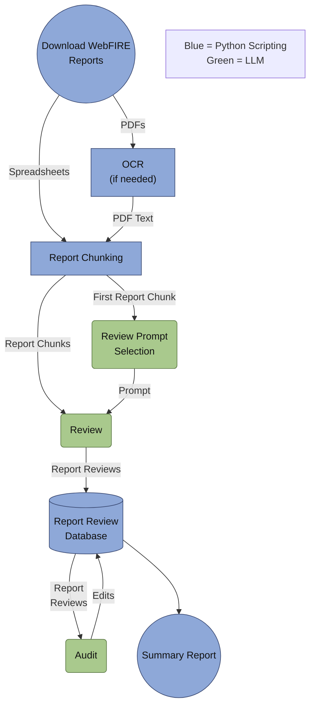

```mermaid
flowchart TB

	%% Defining the nodes and their labels
	RDL((Download WebFIRE<br/>Reports))
	OCR["OCR <br/>(if needed)"]
	RTI(Review Prompt<br/>Selection)
	CHK[Report Chunking]
	AIR("Review")
	AIA(Audit)
	RR[(Report Review<br/>Database)]
	SR((Summary Report))
	TEXT[Blue = Python Scripting<br/>Green = LLM]

	%% Linking the nodes
	RDL -- PDFs --> OCR
	RDL -- Spreadsheets --> CHK
	OCR -- PDF Text --> CHK
	CHK -- First Report Chunk --> RTI
	CHK -- Report Chunks --> AIR
	RTI -- Prompt --> AIR
	AIR -- Report Reviews --> RR
	RR -- Report<br/>Reviews--> AIA
	AIA -- Edits --> RR
	RR --> SR


	%% Create classes for the node colors
	classDef blue fill:#8EA8D8,stroke:#3B4A73,color:#111,stroke-width:1px;
	classDef green fill:#A9C98D,stroke:#5D7A46,color:#111,stroke-width:1px;

	%% Assigning the nodes to their classes
	class RDL,OCR,CHK,RR,SR blue;
	class RTI,AIR,AIA green;
```
