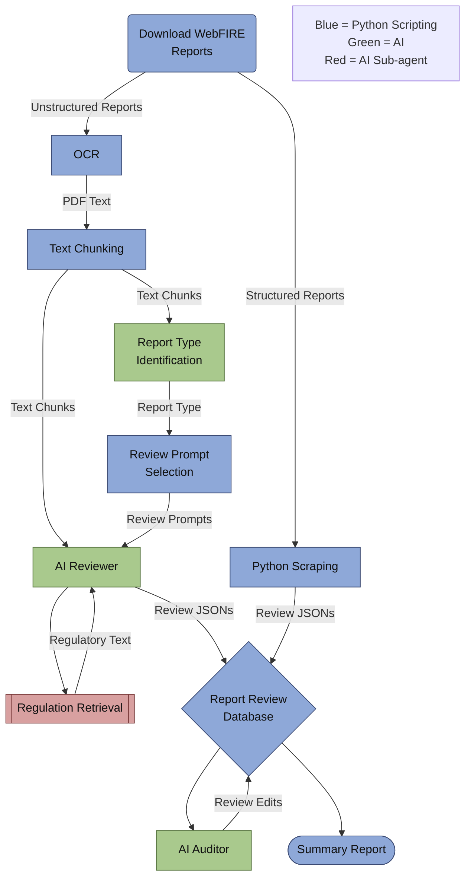

```mermaid
flowchart TB

	%% Defining the nodes and their labels
	RDL(Download WebFIRE<br/>Reports)
	OCR[OCR]
	RTI[Report Type<br/>Identification]
	CHK[Text Chunking]
	AIR["AI Reviewer"]
	REG[[Regulation Retrieval]]
	PrS[Review Prompt<br/>Selection]
	AIA[AI Auditor]
	PS[Python Scraping]
	RR{Report Review<br/>Database}
	SR([Summary Report])
	TEXT[Blue = Python Scripting<br/>Green = AI<br/>Red = AI Sub-agent]

	%% Linking the nodes
	RDL -- Unstructured Reports --> OCR
	OCR -- PDF Text --> CHK
	RDL -- Structured Reports --> PS
	CHK -- Text Chunks --> RTI
	CHK -- Text Chunks --> AIR
	RTI -- Report Type --> PrS
	PrS -- Review Prompts --> AIR
	AIR --> REG
	REG -- Regulatory Text--> AIR
	AIR -- Review JSONs --> RR
	PS -- Review JSONs --> RR
	RR --> AIA
	AIA -- Review Edits --> RR
	RR --> SR


	%% Create classes for the node colors
	classDef blue fill:#8EA8D8,stroke:#3B4A73,color:#111,stroke-width:1px;
	classDef green fill:#A9C98D,stroke:#5D7A46,color:#111,stroke-width:1px;
	classDef red fill:#D8A0A0,stroke:#7A3B3B,color:#111,stroke-width:1px;

	%% Assigning the nodes to their classes
	class RDL,OCR,CHK,PS,RR,SR,PrS blue;
	class RTI,AIR,AIA green;
	class REG red;
```
