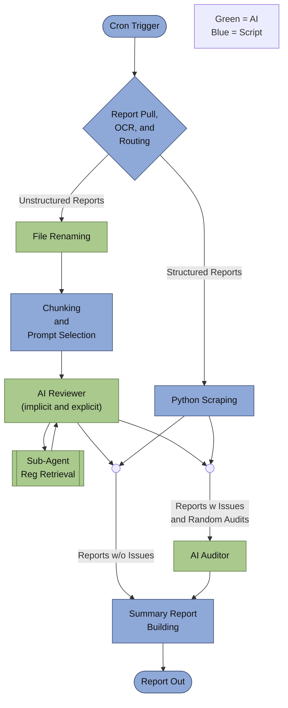

```mermaid
flowchart TB

	%% Defining the nodes and their labels
	TGR([Cron Trigger])
	RPR{Report Pull,<br/>OCR, and<br/>Routing}
	FRC[File Renaming]
	CAP[Chunking<br/>and<br/>Prompt Selection]
	AIR["AI Reviewer<br/>(implicit and explicit)"]
	SAG[[Sub-Agent<br/>Reg Retrieval]]
	JCT1(( ))
	JCT2(( ))
	AIA[AI Auditor]
	PS[Python Scraping]
	SRB[Summary Report<br/>Building]
	RO([Report Out])
	TEXT[Green = AI<br/>Blue = Script]

	%% Linking the nodes
	TGR --> RPR
	RPR -- Unstructured Reports --> FRC
	RPR -- Structured Reports --> PS
	FRC --> CAP
	CAP --> AIR
	AIR --> SAG
	SAG --> AIR
	AIR --> JCT2
	AIR --> JCT1
	PS --> JCT1
	JCT1 -- Reports w Issues<br/>and Random Audits --> AIA
	PS --> JCT2
	JCT2 -- Reports w/o Issues --> SRB
	AIA --> SRB
	SRB --> RO

	%% Create classes for the node colors
	classDef blue fill:#8EA8D8,stroke:#3B4A73,color:#111,stroke-width:1px;
	classDef green fill:#A9C98D,stroke:#5D7A46,color:#111,stroke-width:1px;

	%% Assigning the nodes to their classes
	class TGR,RPR,PS,CAP,SRB,RO blue;
	class FRC,AIR,AIA,SAG green;
```
