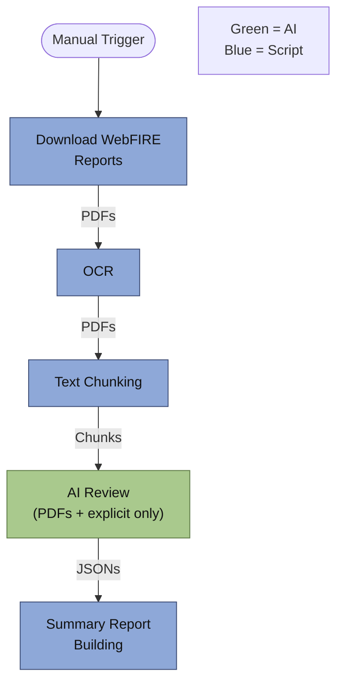

```mermaid
flowchart TB

	%% Defining the nodes and their labels
	Trigger([Manual Trigger])
	RepPull[Download WebFIRE<br/>Reports]
	OCR[OCR]
	TextChunk[Text Chunking]
	AIRev["AI Review<br/>(PDFs + explicit only)"]
	Summary[Summary Report<br/>Building]
	INFO[Green = AI<br/>Blue = Script]

	%% Linking the nodes
	Trigger --> RepPull
	RepPull -- PDFs --> OCR
	OCR -- PDFs --> TextChunk
	TextChunk -- Chunks--> AIRev
	AIRev -- JSONs--> Summary

	%% Create classes for the node colors
	classDef blue fill:#8EA8D8,stroke:#3B4A73,color:#111,stroke-width:1px;
	classDef green fill:#A9C98D,stroke:#5D7A46,color:#111,stroke-width:1px;

	%% Assigning the nodes to their classes
	class RepPull,Route,OCR,TextChunk,Summary blue;
	class AIRev green;
```
