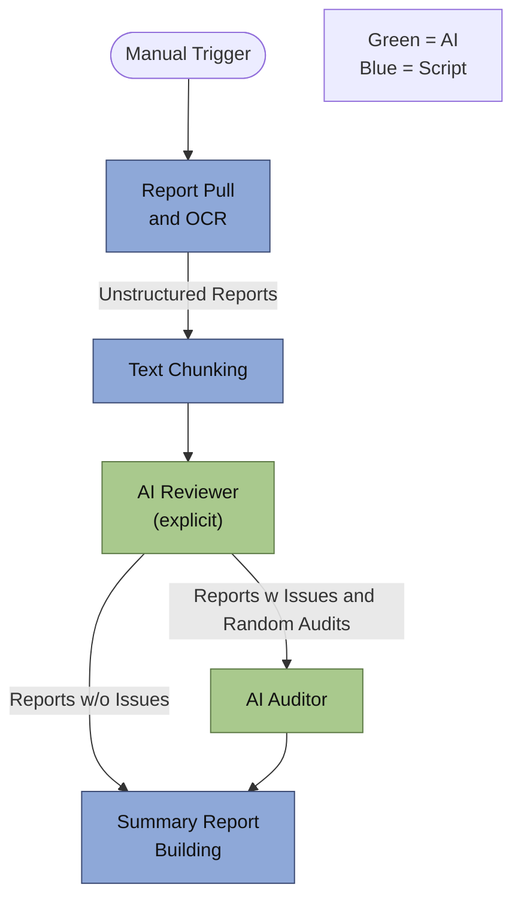

```mermaid
flowchart TB

	%% Defining the nodes and their labels
	TGR([Manual Trigger])
	RPR[Report Pull<br/>and OCR]
	OTC[Text Chunking]
	AIR["AI Reviewer<br/>(explicit)"]
	AIA[AI Auditor]
	SRB[Summary Report<br/>Building]
	TEXT[Green = AI<br/>Blue = Script]

	%% Linking the nodes
	TGR --> RPR
	RPR -- Unstructured Reports --> OTC
	OTC --> AIR
	AIR -- Reports w/o Issues --> SRB
	AIR -- Reports w Issues and Random Audits --> AIA
	AIA --> SRB

	%% Create classes for the node colors
	classDef blue fill:#8EA8D8,stroke:#3B4A73,color:#111,stroke-width:1px;
	classDef green fill:#A9C98D,stroke:#5D7A46,color:#111,stroke-width:1px;

	%% Assigning the nodes to their classes
	class RPR,PS,OTC,SRB blue;
	class AIR,AIA green;
```
